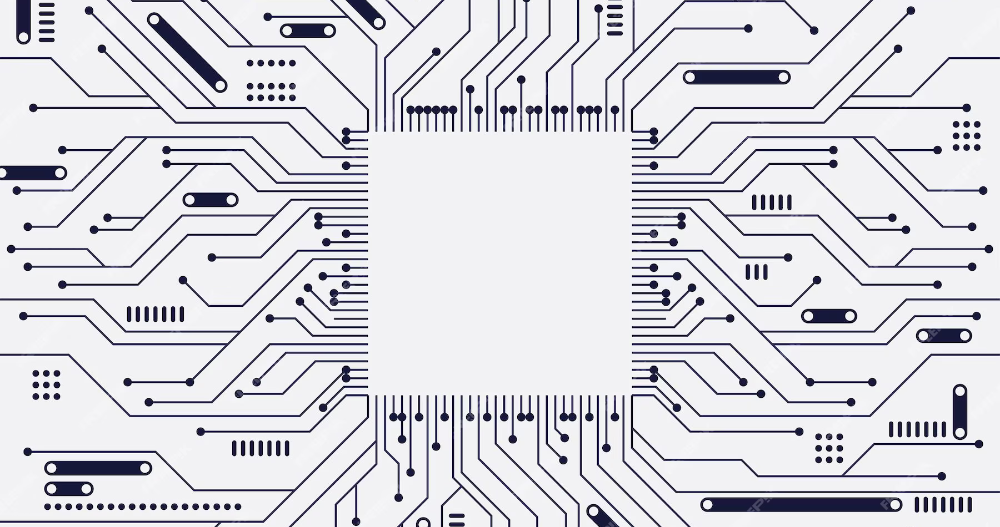

# edge-rs

<!-- [![CI Build Status]][actions] -->
<!-- [![Release]][actions] -->
<!-- [![Tag Build Status]][actions] -->
[![License]][mit-license]
[![Docs]][Docs-rs]
[![Latest Version]][crates.io]
[![rustc 1.31+]][Rust 1.31]

[CI Build Status]: https://img.shields.io/github/actions/workflow/status/refcell/example/ci.yml?branch=main&label=build
[Tag Build Status]: https://img.shields.io/github/actions/workflow/status/refcell/example/tag.yml?branch=main&label=tag
[Release]: https://img.shields.io/github/actions/workflow/status/refcell/example/release.yml?branch=main&label=release
[actions]: https://github.com/refcell/example/actions?query=branch%3Amain

[Latest Version]: https://img.shields.io/crates/v/edge-rs.svg
[crates.io]: https://crates.io/crates/edge-rs
[rustc 1.31+]: https://img.shields.io/badge/rustc_1.31+-lightgray.svg
[Rust 1.31]: https://blog.rust-lang.org/2018/12/06/Rust-1.31-and-rust-2018.html
[License]: https://img.shields.io/badge/license-MIT-7795AF.svg
[mit-license]: https://github.com/refcell/edge-rs/blob/main/LICENSE.md
[Docs-rs]: https://docs.rs/edge-rs/
[Docs]: https://img.shields.io/docsrs/edge-rs.svg?color=319e8c&label=docs.rs

**edge-rs** is https://github.com/refcell/edge-rs/labels/alpha



**[Install](#usage)**
| [User Docs](#what-is-edge-rs)
| [Crate Docs][crates.io]
| [Reference][Docs-rs]
| [Contributing](#contributing)
| [License](#license)

## What is edge-rs?

todo

## Usage

Install `edge-rs` using cargo.

```text
cargo install edge-rs
```

## Contributing

All contributions are welcome! Experimentation is highly encouraged and new issues are welcome.

## Troubleshooting & Bug Reports

Please check existing issues for similar bugs or
[open an issue](https://github.com/refcell/example/issues/new)
if no relevant issue already exists.

## License

This project is licensed under the [MIT License](LICENSE.md).
Free and open-source, forever.
*All our rust are belong to you.*
